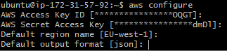

# Setting up an AWS CLI and Python Environment within an EC2

Create a new EC2 instance and `ssh` into it through git bash.

In the terminal, download the AWS CLI installation file using the following `curl` command.

```python
curl "https://awscli.amazonaws.com/awscli-exe-linux-x86_64.zip" -o "awscliv2.zip"
```

To unzip the files, the `unzip` module will be required.

```python
sudo apt install unzip
```

Unzip the installer.

```python
unzip awscliv2.zip
```

Run the install program.

```python
sudo ./aws/install
```

Confirm the installation.

```python
aws --version
```

# Using CRUD with S3 buckets using CLI

Using the CLI, firstly install the software development kit (SDK)

```python
pip install awscli
```

Configure the AWS connection with the following information; Enter the access key, secret access key, region (EU-west-1), output (json)

```python
aws configure
```



Check if access has been acquired by listing the available buckets

```python
aws s3 ls
```

A list of commands are shown below to perform CRUD on S3 buckets using the CLI. 

1. Creating an aws s3 bucket, reminder to state the region.

```python
aws s3 mb s3://tech230-james-bucket --region eu-west-1
```


2. Uploading/updating to a bucket.

>For this example, sending a sampletext.txt file.

```python
aws s3 cp sampletext.txt s3://tech230-james-bucket
```

3. Reading a bucket.

```python
aws s3 sync s3://tech230-james-bucket s3_downloads
```

4. Delete a bucket; reminder, a bucket cannot be deleted if it occupied.

```python
aws s3 rb s3://tech230-james-bucket
```

5. Remove an individual file.

```python
aws s3 rm s3://tech230-james-bucket/sampletext.txt
```

6. Removing everything from a bucket.

```python
Aws s3 rm s3://tech230-james-bucket --recursive
```

# Using CRUD with S3 buckets using python

Install python to the CLI.

```python
sudo apt-get install python3
```

Ensure that pip (pythons package manager) is installed.

```python
sudo apt-get install python3-pip

pip install pip --upgrade
```

Create a virtual environment under the ec2-user home directory

```python
python3 -m venv my_app/env
```

Source the activate file in the bin directoryto activate the environment.

```python
source ~/my_app/env/bin/activate
```

Install the AWS SDK for python in the CLI.

```python
pip install boto3
```

Configure .bashrc to automatically activate the virtual environment when you log in and refresh the terminal.

```python
echo "source /home/ubuntu/my_app/env/bin/activate" >> /home/ubuntu/.bashrc

source ~/.bashrc
```

Enter the python interpreter (quit with `ctrl+d`).

```python
python3
```

A list of commands are shown below to perform CRUD on S3 buckets using python. 

1. Accessing a bucket:

```python
import boto3

# connect to s3
s3 = boto3.resource("s3")

# list buckets
for bucket in s3.buckets.all():
    print(bucket.name)
```

2. Creating a bucket:

```python
import boto3

# connect to s3
s3 = boto3.client("s3")

# create a bucket on s3
bucket_name = s3.create_bucket(Bucket = "tech230-james-boto", CreateBucketConfiguration={"LocationConstraint": "eu-west-1"})

print(bucket_name)
```

3. Uploading a file to a bucket:

```python
import boto3

# connect to s3
s3 = boto3.resource("s3")

# open the file we want to send, store it in a variable called data
data = open("sampletext.txt", "rb")

# specify what bucket we are sending the file to
s3.Bucket("tech230-james-boto").put_object(Key="sampletext.txt", Body=data)
```

4. Downloading a file from a bucket:

```python
import boto3

# connection to client
s3 = boto3.client("s3")

s3.download_file("tech230-james-boto", "sampletext.txt", "sampletext1.txt")

print(s3.download_file)
```

5. Deleting a file from a bucket:

```python
import boto3

# connect to s3
s3 = boto3.resource("s3")

# delete the file in a particular bucket
s3.Object("tech230-james-boto", "sampletext.txt").delete()
```

6. Deleting a bucket:

```python
import boto3

# connect to s3
s3 = boto3.resource("s3")

# delete the bucket
bucket = s3.Bucket("tech230-james-boto")
response = bucket.delete()

print(response)
```
